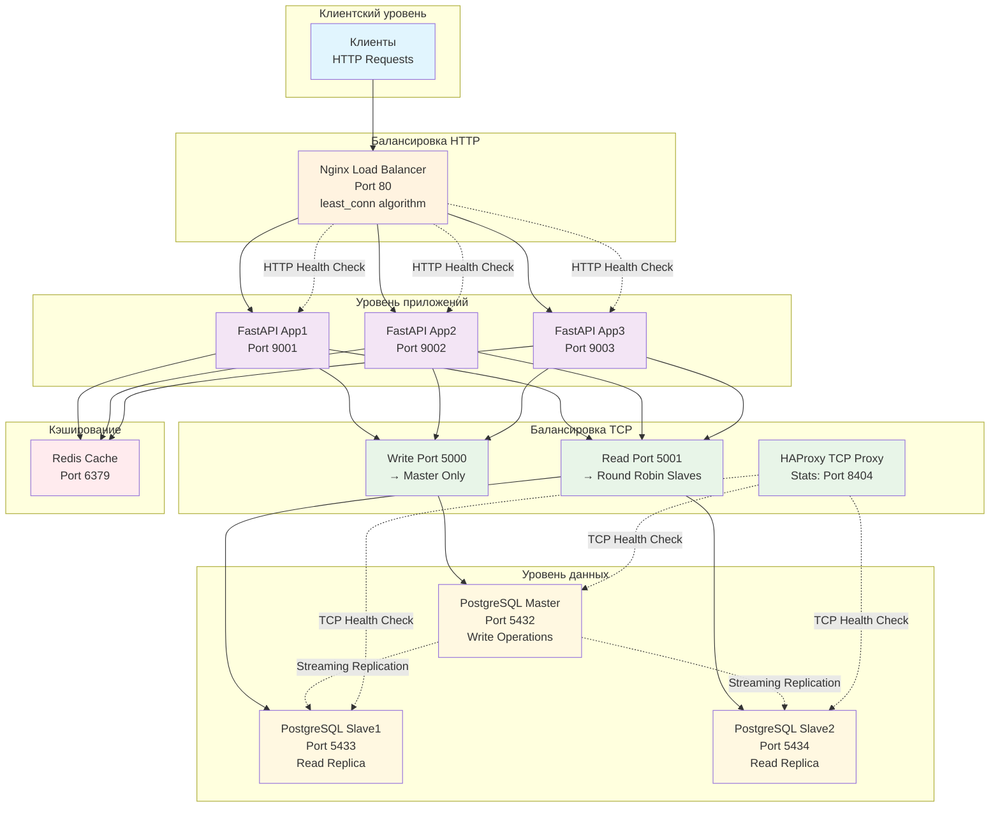

# Архитектура отказоустойчивой системы

```mermaid
graph TB
    subgraph "Клиентский уровень"
        Client[Клиенты<br/>HTTP Requests]
    end

    subgraph "Балансировка HTTP"
        Nginx[Nginx Load Balancer<br/>Port 80<br/>least_conn algorithm]
    end

    subgraph "Уровень приложений"
        App1[FastAPI App1<br/>Port 9001]
        App2[FastAPI App2<br/>Port 9002]
        App3[FastAPI App3<br/>Port 9003]
    end

    subgraph "Балансировка TCP"
        HAProxy[HAProxy TCP Proxy<br/>Stats: Port 8404]
        WritePort[Write Port 5000<br/>→ Master Only]
        ReadPort[Read Port 5001<br/>→ Round Robin Slaves]
    end

    subgraph "Уровень данных"
        Master[PostgreSQL Master<br/>Port 5432<br/>Write Operations]
        Slave1[PostgreSQL Slave1<br/>Port 5433<br/>Read Replica]
        Slave2[PostgreSQL Slave2<br/>Port 5434<br/>Read Replica]
    end

    subgraph "Кэширование"
        Redis[Redis Cache<br/>Port 6379]
    end

    %% Основные связи
    Client --> Nginx
    Nginx --> App1
    Nginx --> App2
    Nginx --> App3

    App1 --> WritePort
    App1 --> ReadPort
    App2 --> WritePort
    App2 --> ReadPort
    App3 --> WritePort
    App3 --> ReadPort

    WritePort --> Master
    ReadPort --> Slave1
    ReadPort --> Slave2

    %% Репликация
    Master -.->|Streaming Replication| Slave1
    Master -.->|Streaming Replication| Slave2

    %% Кэш
    App1 --> Redis
    App2 --> Redis
    App3 --> Redis

    %% Health checks
    HAProxy -.->|TCP Health Check| Master
    HAProxy -.->|TCP Health Check| Slave1
    HAProxy -.->|TCP Health Check| Slave2
    Nginx -.->|HTTP Health Check| App1
    Nginx -.->|HTTP Health Check| App2
    Nginx -.->|HTTP Health Check| App3

    classDef client fill:#e1f5fe
    classDef nginx fill:#fff3e0
    classDef app fill:#f3e5f5
    classDef haproxy fill:#e8f5e8
    classDef database fill:#fff8e1
    classDef redis fill:#ffebee

    class Client client
    class Nginx nginx
    class App1,App2,App3 app
    class HAProxy,WritePort,ReadPort haproxy
    class Master,Slave1,Slave2 database
    class Redis redis
``` 